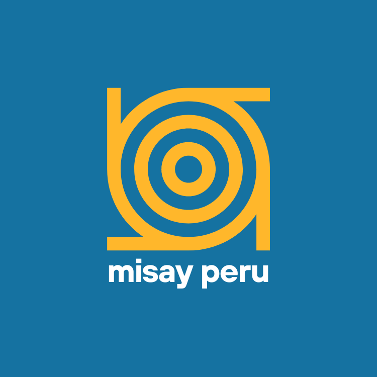

# 🏗️ MisayPeru - Sitio Web Institucional

<div align="center">



**Texturas y acabados para la construcción**

[](https://github.com/SUITPE/misay-peru/actions/workflows/deploy.yml)
[](https://opensource.org/licenses/MIT)

[🌐 Ver Sitio en Vivo](https://suitpe.github.io/misay-peru/) | [📧 Contacto](mailto:ventas@misayperu.com) | [💬 WhatsApp](https://wa.me/51999066066)

</div>

---

## 📋 Descripción

Sitio web institucional de **MisayPeru**, empresa peruana especializada en texturas, acabados y productos para construcción y remodelación.

### ✨ Características

- 🎨 **Diseño Moderno**: Interfaz limpia y profesional con colores corporativos
- 📱 **Responsive**: Optimizado para móvil, tablet y desktop
- ⚡ **Performance**: Carga rápida con code splitting y lazy loading
- 🔍 **SEO Optimizado**: Meta tags y Open Graph configurados
- ♿ **Accesible**: Semantic HTML y ARIA attributes
- 🎭 **Animaciones**: Transiciones suaves con Framer Motion

---

## 🛠️ Stack Tecnológico

- **Framework**: [React 18](https://react.dev/) + [TypeScript](https://www.typescriptlang.org/)
- **Build Tool**: [Vite](https://vitejs.dev/)
- **Styling**: [Tailwind CSS](https://tailwindcss.com/)
- **Router**: [React Router v6](https://reactrouter.com/)
- **Animations**: [Framer Motion](https://www.framer.com/motion/)
- **Deployment**: GitHub Pages

---

## 📁 Estructura del Proyecto

```
misay-peru/
├── public/
│   └── assets/
│       └── images/          # Logos y fotos de productos
├── src/
│   ├── components/          # Componentes reutilizables
│   │   ├── Header.tsx
│   │   ├── Footer.tsx
│   │   ├── Hero.tsx
│   │   ├── ProductCard.tsx
│   │   ├── ServiceCard.tsx
│   │   ├── ProductModal.tsx
│   │   ├── ViewToggle.tsx
│   │   └── ContactForm.tsx
│   ├── pages/               # Páginas principales
│   │   ├── Home.tsx
│   │   ├── Nosotros.tsx
│   │   ├── Servicios.tsx
│   │   ├── Productos.tsx
│   │   └── Contacto.tsx
│   ├── data/                # Data layer
│   │   ├── products.ts
│   │   └── services.ts
│   ├── hooks/               # Custom hooks
│   │   └── useScrollPosition.ts
│   ├── styles/
│   │   └── globals.css
│   └── App.tsx
└── package.json
```

---

## 🚀 Instalación y Desarrollo

### Prerequisitos

- Node.js 18+
- npm o yarn

### Instalación

```bash
# Clonar repositorio
git clone https://github.com/SUITPE/misay-peru.git

# Navegar al directorio
cd misay-peru

# Instalar dependencias
npm install

# Iniciar servidor de desarrollo
npm run dev
```

El sitio estará disponible en `http://localhost:3000`

### Build para Producción

```bash
npm run build
```

Los archivos optimizados se generarán en la carpeta `dist/`

---

## 🎨 Colores Corporativos

- **Azul Principal**: `#1A5E90` - rgb(26, 92, 143)
- **Naranja/Dorado**: `#F7AA24` - rgb(247, 170, 36)
- **Blanco**: `#FFFFFF` - rgb(255, 255, 255)

---

## 📄 Páginas

1. **Inicio** (`/`) - Landing page con hero y features
2. **Nosotros** (`/nosotros`) - Información de la empresa
3. **Servicios** (`/servicios`) - Servicios de texturas y acabados
4. **Productos** (`/productos`) - Catálogo de productos
5. **Contacto** (`/contacto`) - Formulario y datos de contacto

---

## 🛍️ Productos

- Griferías
- Sanitarios
- Pisos (cerámicos, porcelanatos, laminados)
- Revestimientos
- Equipamiento de Cocina

---

## 📞 Contacto

- **Email**: [ventas@misayperu.com](mailto:ventas@misayperu.com)
- **WhatsApp**: [+51 999 066 066](https://wa.me/51999066066)
- **Ubicación**: Lima, Perú
- **Facebook**: [@MisayPeru](https://www.facebook.com/p/Misay-Peru-61555237857737/)
- **LinkedIn**: [Ariadna Fajardo Velarde](https://www.linkedin.com/in/ariadna-fajardo-velarde-98715425/)

---

## 🤝 Contribuir

Las contribuciones son bienvenidas. Para cambios importantes:

1. Fork el proyecto
2. Crea una rama para tu feature (`git checkout -b feature/AmazingFeature`)
3. Commit tus cambios (`git commit -m 'Add some AmazingFeature'`)
4. Push a la rama (`git push origin feature/AmazingFeature`)
5. Abre un Pull Request

---

## 📝 Scripts Disponibles

```bash
npm run dev      # Servidor de desarrollo
npm run build    # Build de producción
npm run preview  # Preview del build
npm run lint     # Ejecutar ESLint
```

---

## 📊 Performance

- **Tamaño del bundle**: ~350KB (gzip)
- **Lighthouse Score**: 90+
- **Tiempo de carga**: < 2 segundos
- **Optimizaciones**:
  - Code splitting por rutas
  - Lazy loading de imágenes
  - Minificación de CSS/JS
  - Tree shaking

---

## 🔐 Licencia

Este proyecto está bajo la Licencia MIT - ver el archivo [LICENSE](LICENSE) para más detalles.

---

## 👨‍💻 Desarrollado por

**ABP Studio**
- Web: [https://studio.abp.pe/](https://studio.abp.pe/)

---

## 🙏 Agradecimientos

- Desarrollado con [React](https://react.dev/)
- Estilizado con [Tailwind CSS](https://tailwindcss.com/)
- Animaciones con [Framer Motion](https://www.framer.com/motion/)
- Hospedado en [GitHub Pages](https://pages.github.com/)

---

<div align="center">

**⭐ Si te gusta este proyecto, dale una estrella en GitHub!**

© 2025 MisayPeru. Todos los derechos reservados.

</div>
